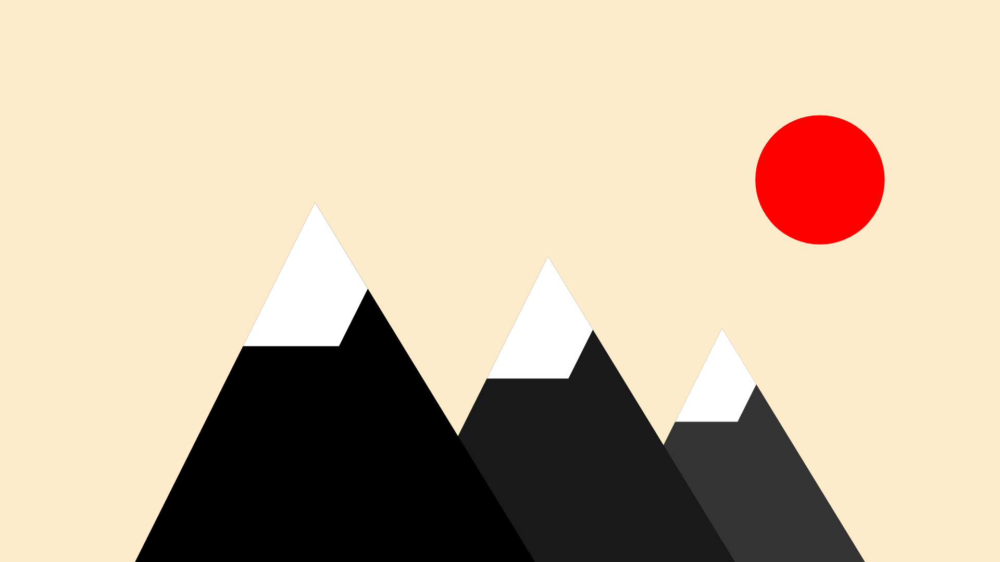
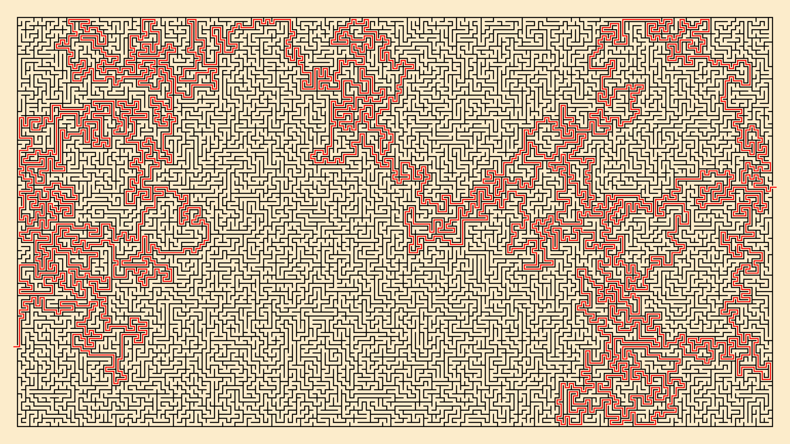
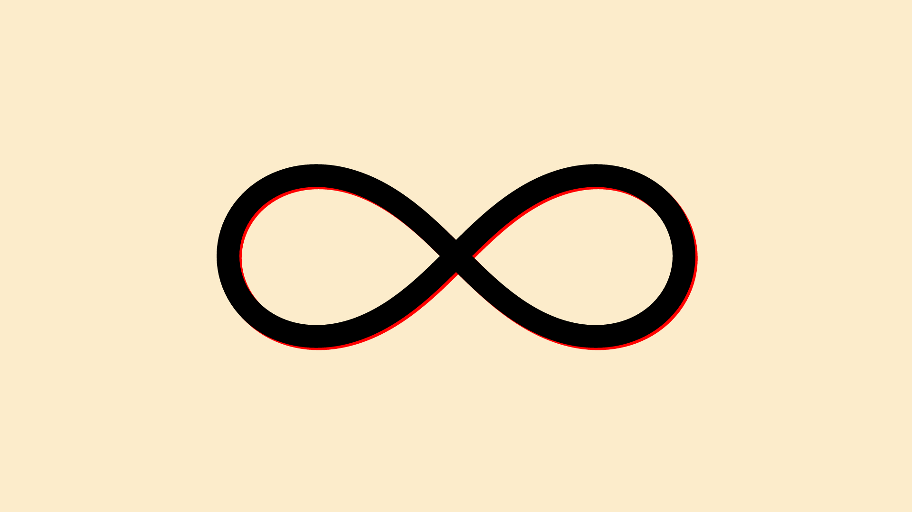
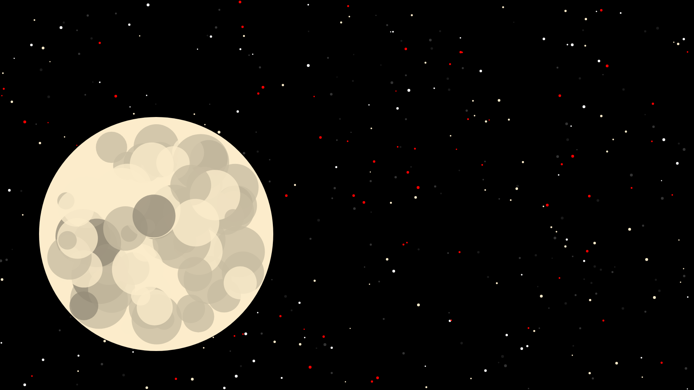
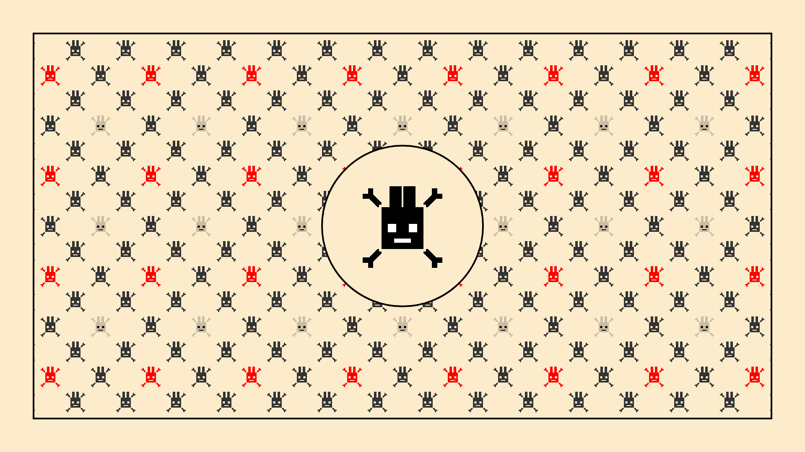
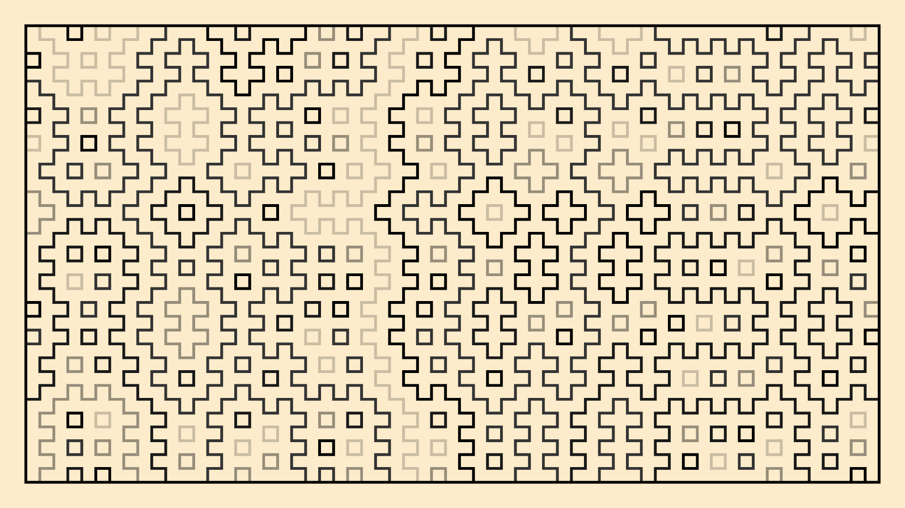

# fractal-trees

Playing with rust, and drawing primitives

I need an excuse to learn #rust, and that could be it.

## Tree

## Moutain range

## Maze

## Mugen

## Night

## Rabbit

## Hitomezashi

Inspired by [@anniek_p](https://twitter.com/anniek_p/status/1244220881347502080)
